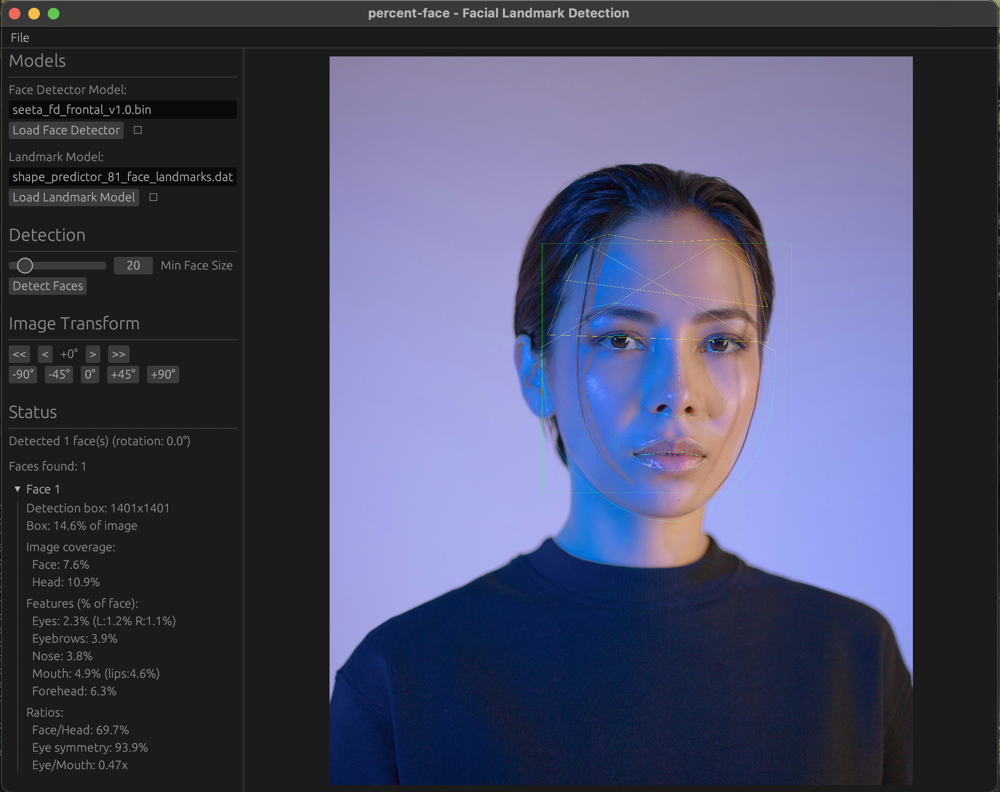

# percent-face

Pure Rust facial landmark detection using Ensemble of Regression Trees (ERT).

This crate implements the algorithm from ["One Millisecond Face Alignment with an Ensemble of Regression Trees"](https://www.cv-foundation.org/openaccess/content_cvpr_2014/papers/Kazemi_One_Millisecond_Face_2014_CVPR_paper.pdf) (Kazemi & Sullivan, CVPR 2014).

## Quick Start

```bash
# Download required models and build
make setup

# Run the GUI
make run-gui
```

## Features

- **Pure Rust** - No C++ dependencies, native dlib model loading
- **Sub-pixel accuracy** - Bilinear interpolation and similarity transforms
- **Multiple models** - Supports 5, 68, and 81-point landmark models
- **GUI application** - Visual face detection and landmark overlay
- **Face metrics** - Calculate face area as percentage of image
- **Cross-platform** - Linux, macOS, and Windows

## GUI Demo



The GUI application provides:
- Face detection using SeetaFace/rustface
- Landmark visualization with connections
- Image rotation controls for testing
- Face area calculations (jawline, head outline)
- Support for 68-point and 81-point models

```bash
make run-gui
```

Or manually:
```bash
cargo run --features gui --bin percent-face-gui
```

### Face Metrics

The GUI calculates and displays:
- **Box area** - Detection bounding box as % of image
- **Jawline area** - Area enclosed by landmarks 0-16
- **Head area** - Full head outline including forehead
  - 81-point model: Uses actual forehead landmarks (68-80)
  - 68-point model: Estimates forehead from facial proportions

## Supported Models

| Model | Points | Description | Size |
|-------|--------|-------------|------|
| `shape_predictor_5_face_landmarks.dat` | 5 | Eyes + nose tip | ~9 MB |
| `shape_predictor_68_face_landmarks.dat` | 68 | Full iBUG model (jaw, brows, eyes, nose, mouth) | ~99 MB |
| `shape_predictor_81_face_landmarks.dat` | 81 | 68-point + forehead/hairline | ~19 MB |
| `seeta_fd_frontal_v1.0.bin` | - | Face detector (SeetaFace) | ~1 MB |

Download all models:
```bash
make download-models
```

## Library Usage

```rust
use percent_face::{BoundingBox, GrayImage};

// Load a dlib model (supports .dat and .dat.bz2)
let model = percent_face::dlib::load_dlib_model("shape_predictor_68_face_landmarks.dat.bz2")?;

// Create/load a grayscale image
let image = GrayImage::new(pixels, width, height);

// Face bounding box from your face detector
let face_rect = BoundingBox::new(x, y, width, height);

// Predict landmarks
let landmarks = model.predict(&image, &face_rect);

for (i, point) in landmarks.points.iter().enumerate() {
    println!("Landmark {}: ({}, {})", i, point.x, point.y);
}
```

### Face Metrics

Calculate facial feature areas and proportions:

```rust
use percent_face::FaceMetrics;

// After getting landmarks...
if let Some(metrics) = FaceMetrics::from_shape(&landmarks) {
    // Areas (in square pixels)
    println!("Face area: {:.0} px²", metrics.jawline_area);
    println!("Left eye: {:.0} px²", metrics.left_eye_area);
    println!("Nose: {:.0} px²", metrics.nose_area);

    // Proportions (as % of face area)
    println!("Eyes: {:.1}% of face", metrics.eyes_ratio());
    println!("Nose: {:.1}% of face", metrics.nose_ratio());
    println!("Mouth: {:.1}% of face", metrics.mouth_ratio());

    // Inter-feature ratios
    println!("Eye symmetry: {:.1}%", metrics.eye_symmetry());
    println!("Eye/Mouth ratio: {:.2}x", metrics.eye_to_mouth_ratio() / 100.0);
}
```

Available measurements:
- **Areas**: jawline, head, left/right eyes, eyebrows, nose, mouth (outer/inner), forehead
- **Ratios**: Each feature as % of face, face-to-head ratio, inter-feature comparisons
- **Symmetry**: Eye symmetry score (100% = perfect symmetry)

### Custom Image Types

Implement the `ImageAccess` trait for your own image types:

```rust
use percent_face::ImageAccess;

impl ImageAccess for MyImage {
    fn get_pixel(&self, x: i32, y: i32) -> u8 {
        // Return grayscale intensity, 0 for out-of-bounds
    }
    fn width(&self) -> u32 { self.width }
    fn height(&self) -> u32 { self.height }
}
```

## Algorithm Overview

The ERT algorithm achieves real-time facial landmark detection through:

1. **Initial Estimate**: Start with mean face shape scaled to the detected face bounding box
2. **Cascade Refinement**: For each of ~10 cascade levels:
   - Sample sparse pixel intensity differences as features
   - Each regression tree in the ensemble votes on landmark position adjustments
   - Sum tree predictions to get shape update
   - Apply update to refine current shape estimate
3. **Output**: Final landmark positions

### Why This Works

- **Sparse features**: Only ~400 pixel comparisons per cascade level (not dense HOG/SIFT)
- **Shape-indexed features**: Pixel locations are relative to current landmark estimates
- **Gradient boosting**: Each cascade level corrects errors from previous levels
- **Simple inference**: Just tree traversal and additions - no convolutions or matrix ops

## Project Structure

```
src/
├── lib.rs          # Public API and module exports
├── types.rs        # Core types: Point, Shape, BoundingBox
├── tree.rs         # RegressionTree, TreeEnsemble, SplitFeature
├── features.rs     # Pixel feature extraction, similarity transforms
├── model.rs        # ShapePredictor (main entry point)
├── dlib.rs         # dlib .dat/.dat.bz2 format loader
├── error.rs        # Error types
└── bin/
    └── gui.rs      # GUI application (optional feature)
```

## Building

### Prerequisites

- Rust 1.70+ (for workspace features)
- curl (for model downloads)
- make (optional, for convenience targets)

### Commands

```bash
# Build library only
cargo build

# Build with GUI
cargo build --features gui

# Run tests
cargo test

# Run GUI
cargo run --features gui --bin percent-face-gui
```

## Implementation Status

### Phase 1: Core Implementation
- [x] Core data structures (Point, Shape, BoundingBox)
- [x] Regression tree structure and traversal
- [x] Tree ensemble (gradient boosting)
- [x] Pixel feature extraction framework
- [x] Cascade inference loop
- [x] Model serialization (bincode)
- [x] dlib .dat/.dat.bz2 format loader (pure Rust)

### Phase 2: Accuracy & Compatibility
- [x] Integrate anchor_idx and deltas into split features
- [x] Test inference against dlib reference (sub-pixel accuracy)
- [x] Bilinear interpolation for sub-pixel sampling
- [x] Similarity transform normalization (rotated faces)
- [x] 81-point model support with forehead landmarks

### Phase 3: GUI & Visualization
- [x] Face detection integration (rustface)
- [x] Landmark visualization with connections
- [x] Image rotation controls
- [x] Face area metrics calculation
- [x] Auto-load models on startup

### Phase 4: Performance (Planned)
- [ ] Benchmarks
- [ ] SIMD optimization for feature extraction
- [ ] Parallel tree evaluation
- [ ] Memory layout optimization

## References

- [One Millisecond Face Alignment with an Ensemble of Regression Trees](https://www.cv-foundation.org/openaccess/content_cvpr_2014/papers/Kazemi_One_Millisecond_Face_2014_CVPR_paper.pdf) - Original paper
- [dlib shape_predictor](http://dlib.net/ml.html#shape_predictor) - Reference implementation
- [81-point model](https://github.com/codeniko/shape_predictor_81_face_landmarks) - Extended forehead landmarks
- [iBUG 300-W dataset](https://ibug.doc.ic.ac.uk/resources/300-W/) - Standard benchmark

## License

MIT
